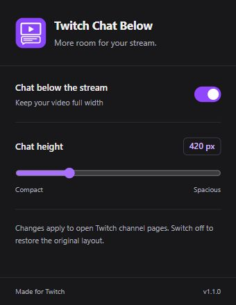

<p align="center">
  
</p>
<h1 align="center">Twitch Chat Below</h1>
<p align="center">More room for your stream. Chat right underneath.</p>
<p align="center">
  <a href="https://github.com/braces157/twitch-chat-below/releases/latest">Download</a> ·
  <a href="PRIVACY.md">Privacy</a> ·
  <a href="https://github.com/braces157/twitch-chat-below/issues">Report an issue</a>
</p>

A lightweight Chrome extension for vertical monitors that moves Twitch's official embedded chat above offers and About, giving the video the full available width. Supports normal and theatre layouts on portrait monitors, with settings stored locally. Landscape monitors keep Twitch's original layout.

<p align="center"></p>

## Features

- **Vertical monitors only** — activate when the monitor is taller than it is wide. A 1920x1080 landscape display keeps Twitch's normal sidebar, even if the browser window is narrow. Moving the window between monitors updates the layout automatically.
- **Full-width video** — hide the right chat sidebar and place chat beneath the stream information, above offers such as Just For You and the About section.
- **Adjustable chat** — drag the bottom edge to resize from 260 to 900 pixels, or use the extension popup. The height is saved automatically. There is no extra toolbar above Twitch chat.
- **About stays visible** — the channel's original About section remains below chat.
- **Theatre support** — full-width video with chat directly underneath at the same width. Twitch navigation is hidden; stream information, offers, and About stay below chat. Fullscreen uses Twitch's normal layout.
- **One-click restore** — switch the extension off to return to the original layout.
- **Local preferences** — no analytics, API keys, signup, or developer-operated server.

## Install in Chrome

1. Download the extension ZIP from the [latest release](https://github.com/braces157/twitch-chat-below/releases/latest).
2. Extract the ZIP into a permanent folder.
3. Open `chrome://extensions` and enable **Developer mode**.
4. Choose **Load unpacked**, then select the extracted folder containing `manifest.json`.
5. Refresh an open Twitch channel page on your vertical monitor.

Pin the extension to Chrome's toolbar to access its settings. You can also load this repository's root folder directly. Keep the installed folder in place; Chrome loads the extension from that location.

This project is distributed through GitHub. It is not currently published on the Chrome Web Store and is not affiliated with Twitch or Google.

## Privacy and permissions

The extension requests only `storage` and runs its content script on `https://www.twitch.tv/*`. It saves the layout toggle and chat height locally. Twitch's own embedded chat handles authentication, messages, and moderation. The extension does not read chat messages or Twitch credentials. See [PRIVACY.md](PRIVACY.md) for details.

## Compatibility

Twitch may change its page structure, so future updates can affect the layout. Switch the extension off if you encounter a problem and [open an issue](https://github.com/braces157/twitch-chat-below/issues) with your Chrome version and the affected channel URL.

Third-party emote extensions such as 7TV may behave differently inside embedded chat. On shorter windows, use a smaller chat height or scroll down. Theatre mode preserves the video's aspect ratio across the full browser width. Exit theatre mode with the player control or Alt+T to restore Twitch navigation.

After updating an unpacked installation, click **Reload** for Twitch Chat Below in `chrome://extensions`, then refresh your Twitch tabs.

## Develop and package

The extension itself has no dependencies or build step. To validate JavaScript, manifest references, PNG dimensions, and create a ZIP, install Python 3.9+ and Node.js, then run:

```sh
python scripts/package.py
```

The archive is written to `dist/`, with `manifest.json` at its root. It includes only runtime files, icons, and the privacy notice. GitHub Actions runs the same validation and uploads a downloadable build artifact.

## Verification

The branded popup was checked in Chrome using a temporary storage adapter: toggling, both height limits, and settings persistence after reload passed, with no browser warnings or errors. The screenshot above shows that preview. The adapter is excluded from the release ZIP.

Version 1.1.0 was also checked as the installed unpacked extension on the live NattyNattLoL page. Chat appeared directly above the visible About section in normal and theatre modes. The header slider resized chat to 260 and 900 pixels, the saved height survived a page reload, and chat returned after fullscreen. No chat messages were sent. Manifest references, PNG dimensions, JavaScript syntax, and ZIP integrity were validated.

Version 1.2.0 was checked in the installed extension on the same page: the custom toolbar was absent, dragging the bottom edge grew and shrank chat, and a precise 453-pixel height survived a reload. Dragging also worked in theatre mode, with About still visible below chat. The original 580-pixel preference was restored after testing.

Version 1.2.1 was checked on the live channel in normal and theatre modes: chat appeared immediately after stream information, above the Just For You offer and About. The bottom resize grip and saved height were preserved.

Version 1.3.0 was checked on the live portrait display. The layout lifecycle was also exercised with simulated monitor dimensions: 1920x1080 landscape (including an 800x1200 browser window), 1080x1920 portrait, square screens, and portrait-to-landscape-to-portrait transitions. Landscape restored the original layout, and the saved chat height remained available when returning to portrait.

Version 1.3.1 was checked as the installed extension on the live channel: theatre video and chat both spanned the full 842.4-pixel browser content width, with no gap between them. Navigation returned on exiting theatre, and chat stayed above offers and About. Bottom-edge dragging changed the saved height from 707 to 757 pixels; the original 707-pixel height was restored. Native fullscreen hid chat, and exiting fullscreen restored the full-width theatre layout. Packaging validation passed.

The original generated artwork and generation prompt are recorded in [assets/](assets/README.md). Changes are recorded in [CHANGELOG.md](CHANGELOG.md).

## Remove

Remove Twitch Chat Below in `chrome://extensions`, then refresh Twitch. Chrome removes the extension's stored preferences.
